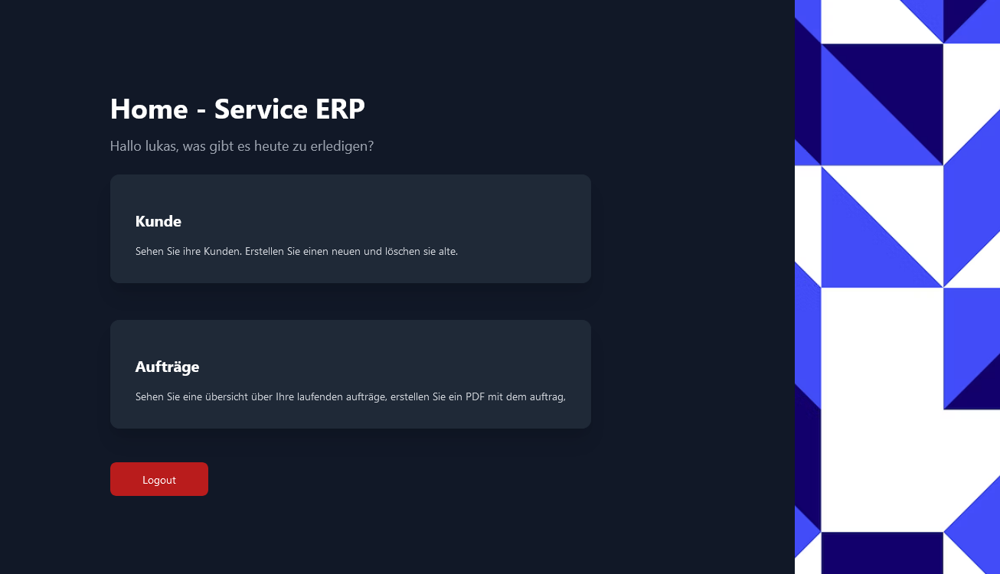

# ServiceAuftrag

This PHP project was a final project for a school module (294/295) and represented ERP software for a sanitary company. It was used to manage business transactions such as orders, customer data and employees.

### Details about our task

**Task**

Design a web application that maps the process and allows the entry of an order.

The company Glauser Illnau AG is a sanitary company. In addition to new construction and conversion projects, repair and maintenance work is also carried out on behalf of customers.

The internal procedure for this is:
1. administration: accept order (usually by telephone)
2. division manager: schedule/plan order (assign to an employee and possibly set a concrete date)
3rd employee: Execute and report on the order
3. division manager: supervise execution administratively
4. division manager: check report and release for invoicing
5. administration: charge order

For each order, an order sheet is created upon acceptance, which accompanies the entire process.

### Technologies used

In the implementation of the project, we relied on various programming languages, technologies and interfaces.

- TailwindCSS
- jsPDF
- PHP/JS

### Installation

- Execute the SQL file in your Database system.
- Edit the "src/php/inlclude/db.php" to match your Database system's config
- Copy the "src/" directory into a folder where your Webserver is working (must have PHP installed!!!)

You will get prompted to login. The default username and password are "root" and "root".

### Conftributors

This project was realised by the following people and would not have been possible without them:

- Aya
- Jessica
- Lukas
